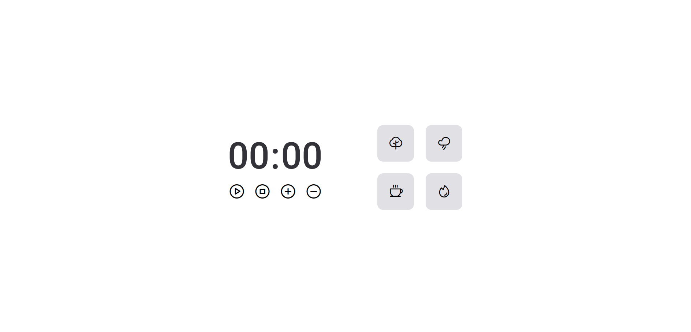

# Focus Timer

## Descrição

O Focus Timer é uma aplicação web projetada para ajudar os usuários a gerenciar seu tempo de forma eficaz, utilizando a técnica Pomodoro ou qualquer outra técnica de gerenciamento de tempo que preferirem. Com uma interface limpa e intuitiva, o aplicativo permite aos usuários iniciar, pausar e resetar o cronômetro com facilidade, além de ajustar o tempo conforme suas necessidades específicas. 
Além disso, o Focus Timer oferece uma seleção de áudios de fundo para criar um ambiente de trabalho ou estudo mais produtivo e agradável.

## Funcionalidades

- **Cronômetro**: Inicie, pause e resete o tempo com facilidade.
- **Ajustes de Tempo**: Adicione ou subtraia cinco minutos ao cronômetro.
- **Sons de Notificação**: Receba notificações sonoras quando um ciclo se completa.

## Tecnologias Utilizadas

- HTML5
- CSS3
- JavaScript
- [Phosphor Icons](https://phosphoricons.com/)

## Acesso ao Projeto

Você pode acessar e testar a versão mais recente do Focus Timer online através do seguinte link hospedado no Vercel:

- [Focus Timer Live](https://focus-timer-beige.vercel.app/)

## Como Usar

1. **Iniciar o Cronômetro**: Clique no botão de play para começar a contagem.
2. **Pausar o Cronômetro**: Clique no botão de pausa para interromper temporariamente a contagem.
3. **Resetar o Cronômetro**: Clique no botão de stop para resetar o cronômetro.
4. **Ajustar Tempo**: Utilize os botões de mais e menos para ajustar o tempo do cronômetro.
5. **Áudios de Fundo**: Escolha entre uma variedade de áudios de fundo para melhorar sua concentração e produtividade. Acesse a seleção de áudios através do menu de configurações e selecione o que mais lhe agrada para tocar enquanto o cronômetro está ativo.

## Instalação

Para rodar o Focus Timer localmente, siga estes passos:

1. Clone o repositório para sua máquina local:
**git clone https://github.com/eduardossimas/Focus-Timer.git**

2. Abra o arquivo `index.html` em seu navegador.

## Contribuindo

Contribuições são sempre bem-vindas! Veja como:

1. Faça o Fork do projeto.
2. Crie uma Branch para sua Feature (`git checkout -b feature/AmazingFeature`).
3. Adicione suas mudanças (`git add .`).
4. Commit suas mudanças (`git commit -m 'Add some AmazingFeature'`).
5. Push para a Branch (`git push origin feature/AmazingFeature`).
6. Abra um Pull Request.

## Licença

Distribuído sob a licença MIT. Veja `LICENSE` para mais informações.

## Contato

Eduardo Salzer - (https://www.linkedin.com/in/eduardo-salzer-simas-332472297/) - dudusalzer13@gmail.com

Link do Repositório do Projeto: <https://github.com/eduardossimas/Focus-Timer>

